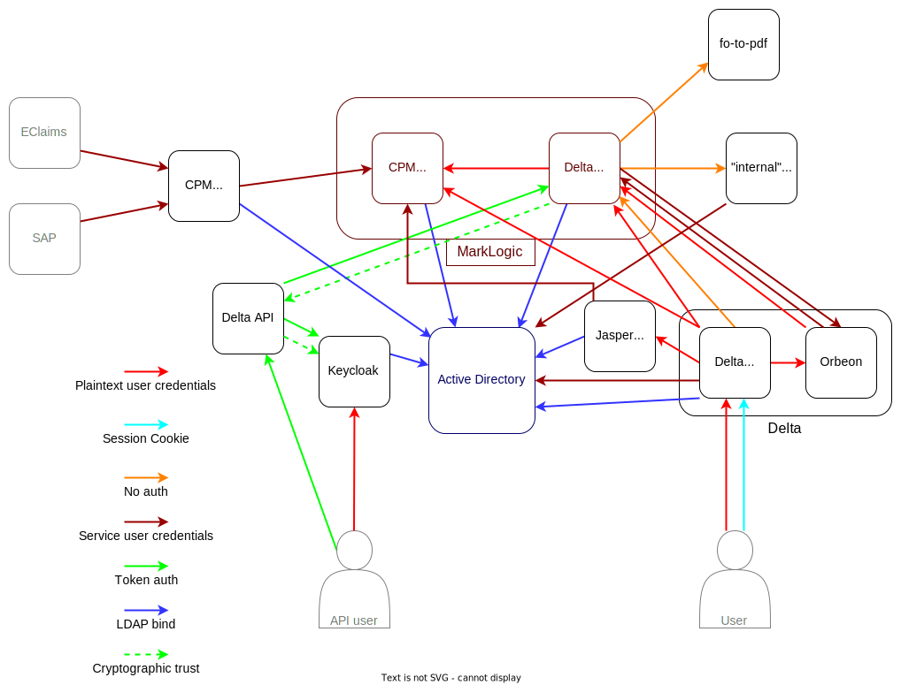
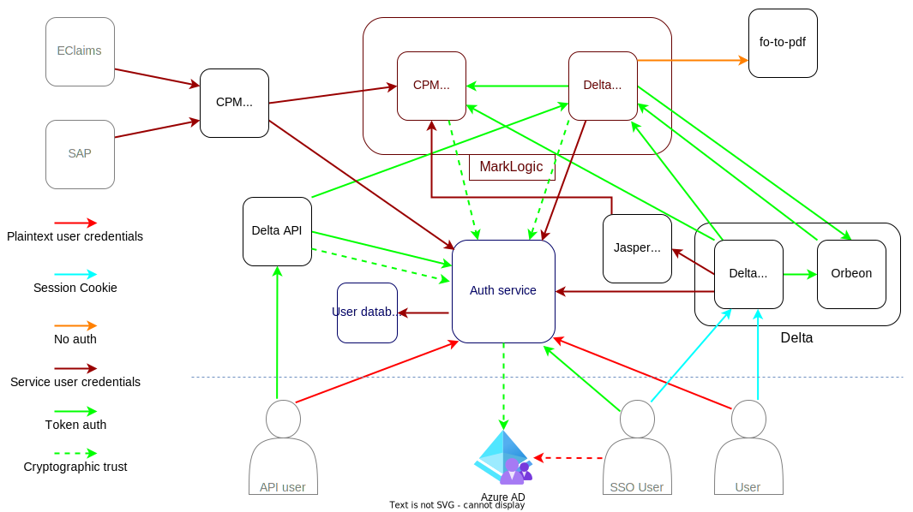

# Auth planning

See <https://digital.dclg.gov.uk/confluence/display/DT/Enhancement+Mini-Projects#EnhancementMiniProjects-UserAuthServiceChanges>.

## Current state

Authentication in Delta is currently centred around an on-premises Active Directory ("AD") domain.
The applications authenticate over LDAP, including MarkLogic authenticating requests from Delta.

  
_A high level overview of authentication and trust relationships in the Delta ecosystem. Some components are omitted for simplicity._

## Department and user-facing aims

We would like to:

* Make Delta's permission system clearer and easier to use
* Use SSO where organisations can support it
* Improve Delta's security posture
* Ensure regulatory compliance for user data

And the current setup makes these difficult.

## Technical aims

* Single source of truth for authentication and user data
* Move user and organisation data out of MarkLogic
* Retire (on prem) Active Directory
* Simplify and improve user management in Delta
* Build a better foundation for future improvements

## Phase 1 - Deploy SAML changes

Aim: Stop Delta sending plaintext credentials to Orbeon. This resolves the specific vulnerability found in last summer's pen test.

* Simplify TSO's SAML token generation to avoid depending on Keycloak
* Make required configuration and infrastructure code changes (TSO have done this manually on Datamart staging)
* Test and deploy SAML changes

## Phase 2 - Authentication service for Delta

Aims:

* Completely remove plaintext credentials from Delta, fully resolving the pen test issue
* Implement SSO for DLUHC users

Steps:

* Stand up a new auth service
* Send all Delta logins through the new auth service, changing Delta to use that as the source of user permissions
* Move SAML token generation to this new service
* Remove ML cascade job dependency on API, remove Orbeon passthrough
* Change Delta -> JasperReports to use service users instead of plaintext user credentials
* Remove plaintext credentials from Delta's session state
* Implement SSO via Azure AD for DLUHC users - authentication only, the users would still exist in on-prem AD

## Phase 3 - Strangle AD

Change all LDAP requests into API calls via the auth service, which then makes the call through to AD.

In some cases it may be simpler to move functionality into the authentication service (e.g. internal certifiers app, password reset flow), in which case we will do that.

## Phase 4 - Replace AD

Now that the auth service is the only component talking to Active Directory, we can replace it with a relational database, migrating existing users across.

Move user and organisation data out of MarkLogic. Put PII deletion/anonymisation processes in place to comply with GDPR.

## Onwards

This gives us a foundation to make further improvements, for example:

* Update and improve Delta's user and account management
* Enrol external organisations in SSO
* Splitting Delta into multiple services without being tied to Active Directory and MarkLogic for auth

  
_The target architecture in the medium term_

## Appendix

### Appendix 1 - other limitations of the current setup

* Delta's authentication setup is buggy and insecure
* Most requests are not encrypted in transit, many of which include plaintext user credentials
* Some requests are completely unauthenticated
* Active Directory (on premises) is poorly suited to managing Website users
  * It's expensive (though not compared to MarkLogic), requires specialised knowledge and is hard to extend
  * Load balancing between Domain Controllers results in consistency issues, so there is no automatic failover, unlike the rest of the infrastructure
* Delta's permissions are complex and a poor fit for Active Directory's groups
  * This leads to complexity and bugs - there are about ten times as many groups as active users in AD!
* MarkLogic document level security is based on AD groups
  * This tight coupling makes changes hard
  * The large number of groups leads to performance issues
* There is no single source of truth, or trust, authentication/authorisation related information is spread between AD and MarkLogic
* Delta stores user credentials in plain text and forwards them to several other services, a previous pen test noted Orbeon forms can be configured to then forward those credentials to the internet
* User PII is spread across Active Directory and MarkLogic, with no processes in place to anonymise or delete it as required by GDPR

### Appendix 2 - SAML implementation

TSO have been working on changing Delta to use SAML for some authentication to MarkLogic.
This is deployed to the old staging environment and TSO have informed us it's working.

We will iterate on this to reduce the complexity.

  
_Architecture after SAML changes as implemented by TSO_
